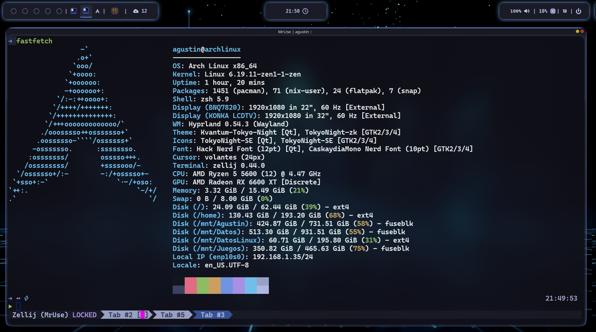

# dotfiles

Configuración personal para Arch Linux con Hyprland.

> **Nota:** Este repo está diseñado para mi setup específico (GPU AMD, tema TokyoNight).
> El instalador te pregunta sobre las partes opcionales antes de hacer cualquier cosa.

## Mini preview

<p align="center">
  
  
</p>

## Stack

| Categoría | Herramienta |
|---|---|
| Compositor | Hyprland |
| Terminal | Ghostty + Zellij |
| Shell | Zsh + Oh My Posh |
| Editor | Neovim |
| Bar | Waybar |
| Notificaciones | Dunst |
| File manager | Thunar + Yazi |
| Tema | TokyoNight |
| Cursor | volantes_cursors |

---

## Instalación

### Requisitos previos

- Arch Linux (o derivado)
- Conexión a internet
- `go` instalado (`sudo pacman -S go`)

### 1. Clonar el repo

```bash
git clone --recurse-submodules https://github.com/MrUse77/dotfiles.git ~/dotfiles
```

> El flag `--recurse-submodules` es importante. Sin él los plugins de zsh y el
> config de neovim quedarán como carpetas vacías.

Si ya clonaste sin ese flag:

```bash
git submodule update --init --recursive
```

### 2. Compilar el instalador

```bash
cd ~/dotfiles/cli
go build -o dots
```

### 3. Correr el instalador

```bash
./dots install
```

El instalador va a preguntarte interactivamente:

1. ¿Estás seguro que querés modificar tu sistema?
2. Modo de instalación: **Usuario** (copia limpia)
3. ¿Tenés GPU AMD? (instala `corectrl`)
4. ¿Instalar plugins de Hyprland via `hyprpm`?

Luego ejecuta automáticamente:

1. Actualizar el sistema e instalar `base-devel` y `git`
2. Instalar `paru` (AUR helper) si no está
3. Instalar todos los paquetes necesarios (oficiales + AUR)
4. Configurar `zsh` como shell por defecto
5. Inicializar submódulos de Git (plugins de zsh + Neovim)
6. Respaldar configs existentes en `~/.config-backup-<timestamp>`
7. Copiar todos los configs a `~/.config/`
8. Copiar `.zshrc`, `.gtkrc-2.0`, `oh-my-posh/`, `.zsh_plugins/`, `.themes/`
9. Instalar fuentes y cursor theme + `fc-cache`
10. Aplicar temas GTK via `gsettings`
11. Habilitar servicios (`upower`, `power-profiles-daemon`)
12. Configurar variables de entorno Qt/Wayland en `/etc/profile.d/`
13. (Opcional) Instalar plugins de Hyprland: `hyprbars`, `split-monitor-workspaces`

### Runtime theme selection (normal install)

The normal user installation deploys the MoonArch selector and immutable theme bundles under `~/.local/moonarch/`. A fresh installation activates Tokyo Night through the relative link:

```text
~/.local/moonarch/themes/current -> tokyo-night
```

Consumer configurations read their fragments through `current`; do not replace this link with an absolute path or edit bundle contents. Press `Super+Shift+T` to open Wofi and select a valid theme name, or run the selector directly:

```bash
~/.local/moonarch/bin/theme-selector <theme-id>
```

Running the selector without an ID lists valid bundles in Wofi. Hyprland and Waybar reload after a successful switch; Ghostty reads the selected fragment when a new terminal starts.

### Theme rollback

Selection validates the complete bundle before changing `current` and replaces the link atomically. If Hyprland or Waybar reload fails, the selector restores the previous link, retries the consumer refresh on a best-effort basis, and exits non-zero. Verify the active bundle with:

```bash
readlink -- ~/.local/moonarch/themes/current
```

To return to a known-good bundle, select its name with the same selector command. Keep `current` relative to the themes directory; do not repair a failed selection by copying fragments into consumer configuration files.

### 4. Después de instalar

1. Reiniciar sesión o el sistema
2. Abrir `qt5ct` → seleccionar estilo **kvantum**
3. Ejecutar `nwg-look` para confirmar los temas GTK

---

## CLI: comandos disponibles

```bash
./dots install       # Instalador interactivo completo
./dots help          # Ver todos los comandos
```

---

## Estructura del repo

```text
dotfiles/
├── .config/
│   ├── dunst/          # Notificaciones
│   ├── eww/            # Widgets
│   ├── ghostty/        # Terminal
│   ├── gtk-3.0/        # Tema GTK3
│   ├── gtk-4.0/        # Tema GTK4
│   ├── hypr/           # Hyprland, hyprlock, hyprpaper, hypridle, hyprsunset
│   │   └── scripts/    # Scripts de autostart
│   ├── nvim/           # Config de Neovim (submodule → MrUse77/Nvim-config)
│   ├── nwg-dock-hyprland/
│   ├── waybar/
│   │   ├── style.css
│   │   └── colors.css  # Variables de color (theming dinámico)
│   ├── wofi/
│   ├── yazi/
│   └── zellij/
├── .zsh_plugins/       # Plugins de zsh (submodules)
├── assets/
│   ├── fonts/          # CaskaydiaCove, CaskaydiaM, Hack Nerd Font
│   └── icons/          # volantes_cursors
├── cli/                # Instalador Go (dots)
│   ├── cmd/            # Comandos cobra del instalador
│   ├── pkg/
│   │   └── installer/  # Lógica de instalación del sistema
│   └── main.go
├── oh-my-posh/         # Temas de prompt (.omp.json)
├── .themes/            # Temas GTK
├── .zshrc
└── .gtkrc-2.0
```

---

## Submodules

Este repo usa **git submodules** para manejar repos externos sin duplicar código.

| Path | Repo | Descripción |
|---|---|---|
| `.config/nvim` | `MrUse77/Nvim-config` | Config personal de Neovim |
| `.zsh_plugins/fzf-tab` | `Aloxaf/fzf-tab` | Completado con fzf |
| `.zsh_plugins/zsh-autosuggestions` | `zsh-users/zsh-autosuggestions` | Sugerencias inline |
| `.zsh_plugins/zsh-history-substring-search` | `zsh-users/zsh-history-substring-search` | Búsqueda en historial |
| `.zsh_plugins/zsh-syntax-highlighting` | `zsh-users/zsh-syntax-highlighting` | Highlight de sintaxis |

### Comandos útiles

```bash
# Actualizar todos los submodules
git submodule update --remote --merge

# Ver estado de cada submodule
git submodule status
```

---

## Actualizar dotfiles en una nueva máquina

```bash
git clone --recurse-submodules https://github.com/MrUse77/dotfiles.git ~/dotfiles
cd ~/dotfiles/cli
go build -o dots
./dots install
```

## Sincronizar cambios desde otra máquina

```bash
cd ~/dotfiles
git pull
git submodule update --recursive
```
