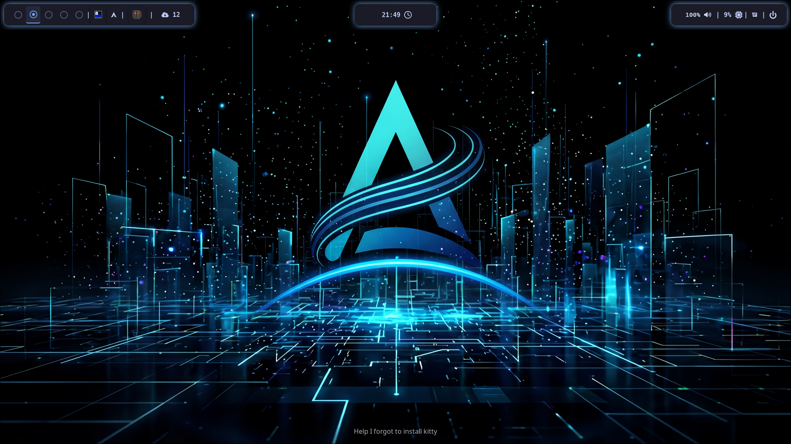

# dotfiles

Configuración personal para Arch Linux con Hyprland.

> **Nota:** Este repo está diseñado para mi setup específico (GPU AMD, tema TokyoNight).
> El instalador te pregunta sobre las partes opcionales antes de hacer cualquier cosa.

## Vista previa

<p align="center">
  
  
</p>

## Stack

| Categoría | Herramienta |
|---|---|
| Compositor | Hyprland |
| Terminal | Ghostty + Zellij |
| Shell | Zsh + Oh My Posh |
| Editor | Neovim |
| Bar | Waybar |
| Lanzador | Rofi |
| Notificaciones | Dunst |
| Gestor de archivos | Thunar + Yazi |
| Tema | TokyoNight |
| Cursor | volantes_cursors |

---

## Instalación

### Requisitos previos

- Arch Linux (o derivado)
- Conexión a internet
- `rofi-wayland` instalado (lanzador unificado)
- Hack Nerd Font instalada (iconos y tipografía del menú)
- Calculadora opcional: `rofi-calc-wayland` (o equivalente) junto con `libqalculate`

> El flujo rápido no requiere Go ni Git: baja el binario ya compilado. En una máquina sin git, el propio instalador lo instala (con tu confirmación) antes de clonar el repo. La instalación manual de abajo sí necesita Go.

### Instalación rápida (un comando)

```bash
curl -fsSL https://raw.githubusercontent.com/MrUse77/dotfiles/main/scripts/install.sh | bash
```

Baja el binario `moonarch-cli` de la **última release estable** (verificado por checksum, sin Go ni Git) y corre `moonarch-cli install` con sus confirmaciones interactivas. El binario clona el repo en `~/.cache/dotfiles` si falta (siempre su propia versión, nunca `main`) e instala con backups y rollback. Para cambiar el destino del clon: `DOTFILES_DIR=~/otro/lugar moonarch-cli install`. Para desarrollo, usá la instalación manual de abajo.

> La instalación ahora tiene dos pasos para los plugins de Hyprland: `install` instala paquetes y configuraciones, pero difiere `hyprpm` para no bloquear una sesión sin Hyprland. Si seleccionás `hypr-plugins`, iniciá Hyprland y ejecutá `moonarch-cli plugins`.
>
> La instalación manual de abajo sigue siendo válida si preferís controlar cada paso.

### Instalación manual

### 1. Clonar el repo

```bash
git clone --recurse-submodules https://github.com/MrUse77/dotfiles.git ~/.cache/dotfiles
```

> El flag `--recurse-submodules` es importante. Sin él los plugins de zsh y el
> config de neovim quedarán como carpetas vacías.

Si ya clonaste sin ese flag:

```bash
git submodule update --init --recursive
```

### 2. Compilar el instalador (requiere Go: `sudo pacman -S go`)

```bash
cd ~/.cache/dotfiles/cli
go build -o moonarch-cli .
```

### 3. Correr el instalador

```bash
./moonarch-cli install
```

El instalador va a preguntarte interactivamente:

1. ¿Estás seguro que querés modificar tu sistema?
2. Modo de instalación: **Usuario** (copia limpia)
3. ¿Tenés GPU AMD? (instala `corectrl`)
4. ¿Seleccionar plugins de Hyprland para instalarlos después con `moonarch-cli plugins`?

Luego ejecuta automáticamente:

1. Actualizar el sistema e instalar `base-devel` y `git`
2. Instalar `paru` (AUR helper) si no está
3. Instalar todos los paquetes necesarios (oficiales + AUR)
4. Configurar `zsh` como shell por defecto
5. Inicializar submódulos de Git (plugins de zsh + Neovim)
6. Respaldar configs existentes en `~/.dots-backups/<runID>/` (los backups se retienen, no se borran)
7. Instalar configs en `~/.config/` y root files (`.zshrc`, `.gtkrc-2.0`, etc.) con transacción: cada target se respalda antes de mutar y, si algo falla, se restaura automáticamente desde el backup
8. Instalar fuentes y cursor theme + `fc-cache`
9. Aplicar temas GTK via `gsettings`
10. Habilitar servicios (`upower`, `power-profiles-daemon`)
11. Configurar variables de entorno Qt/Wayland en `/etc/profile.d/`
12. Si seleccionaste plugins de Hyprland, informar que quedaron diferidos para el segundo paso

Los plugins seleccionados no bloquean la instalación principal. Después de iniciar Hyprland, ejecutá:

```bash
./moonarch-cli plugins
```

El comando vuelve a mostrar el plan, permite cancelarlo y detiene la secuencia ante el primer error real de `hyprpm`.

Con `--only` elegís un subconjunto de plugins, p. ej. `./moonarch-cli plugins --only hyprbars`; sin el flag se instalan todos los plugins del catálogo (`hyprbars` y `split-monitor-workspaces`).

### Selección de tema en runtime (instalación normal)

La instalación normal despliega el selector MoonArch en `~/.local/bin/moonarch/` y los bundles de temas inmutables en `~/.local/share/moonarch/themes/`. Una instalación limpia activa Tokyo Night mediante el link relativo:

```text
~/.local/share/moonarch/themes/current -> tokyo-night
```

Las configuraciones consumidoras leen sus fragmentos a través de `current`; no reemplaces este link por una ruta absoluta ni edites el contenido de los bundles. Presioná `Super+Shift+T` para abrir Rofi y elegir un nombre de tema válido, o ejecutá el selector directamente:

```bash
~/.local/bin/moonarch/theme-selector <theme-id>
```

Ejecutar el selector sin un ID lista los bundles válidos en Rofi. Hyprland y Waybar recargan tras un cambio exitoso; Ghostty lee el fragmento seleccionado al abrir una terminal nueva.

### Atajos de Rofi

| Atajo | Acción |
|---|---|
| `Super + M` | Abre el lanzador de aplicaciones (Rofi `drun`) |
| `Super + Tab` | Cambia entre ventanas abiertas (Rofi `window`) |
| `Super + R` | Ejecuta comandos / calculadora (Rofi `run` / `calc`) |
| `Super + Shift + X` | Abre el menú de sesión (Rofi `powermenu`) |

> La calculadora depende del plugin `calc` de Rofi. Si no está disponible,
> `Super + R` sigue abriendo el modo `run` normalmente.

### Rollback de tema

La selección valida el bundle completo antes de cambiar `current` y reemplaza el link de forma atómica. Si la recarga de Hyprland o Waybar falla, el selector restaura el link anterior, reintenta el refresh de los consumidores en modo best-effort y sale con código no cero. Verificá el bundle activo con:

```bash
readlink -- ~/.local/share/moonarch/themes/current
```

Para volver a un bundle que sabés que funciona, seleccioná su nombre con el mismo comando. Mantené `current` relativo al directorio de temas; no repares una selección fallida copiando fragmentos en los archivos de configuración de los consumidores.

### 4. Después de instalar

1. Reiniciar sesión o el sistema
2. Abrir `qt5ct` → seleccionar estilo **kvantum**
3. Ejecutar `nwg-look` para confirmar los temas GTK

### Restauración de backups

Cada instalación deja un backup retenido en `~/.dots-backups/<runID>/` (archivos originales + `inventory.json`). Para volver al estado previo a una instalación:

```bash
./moonarch-cli restore
```

Elegís el run y los targets interactivamente. Para ir directo a un run: `moonarch-cli restore --run <ID>`. Los backups nunca se borran automáticamente; si querés liberar espacio, eliminá el directorio del run a mano.

---

## CLI: comandos disponibles

```bash
./moonarch-cli install       # Instalador interactivo de paquetes y dotfiles
./moonarch-cli update        # Actualiza el binario y dotfiles a la última release
./moonarch-cli plugins       # Instala plugins de Hyprland con Hyprland activo
./moonarch-cli help          # Ver todos los comandos
```

### `moonarch-cli update`

Actualiza el binario gestionado y el cache de dotfiles a la última release
publicada, y reaplica **solo** la configuración basada en archivos.

> **Solo disponible en builds de release.** Si compilás localmente sin tag,
> `cmd.Version` es `dev` y el comando sale con `0` sin hacer nada. Para usarlo,
> descargá el binario de una release o compilá con `-ldflags` inyectando un tag.

```bash
./moonarch-cli update
```

Requiere acceso online a GitHub. Podés usar `GITHUB_TOKEN` para evitar límites
de rate de la API:

```bash
GITHUB_TOKEN=ghp_xxx ./moonarch-cli update
```

Qué hace:

1. **Release**: resuelve el último tag de `MrUse77/dotfiles` vía la API de GitHub.
2. **Binario**: compara la versión instalada con el tag; si es menor, descarga
   `moonarch-cli-linux-{amd64,arm64}` (según `GOARCH`), verifica el SHA-256 contra
   `SHA256SUMS.txt` y reemplaza el ejecutable en `~/.local/bin/moonarch-cli` de
   forma atómica. El nuevo binario se activa en la **próxima invocación**; el
   proceso actual termina el resto de las etapas sin re-exec.
3. **Repositorio**: clona o actualiza `~/.cache/dotfiles` exactamente al tag de
   release (no `main`, no `DOTFILES_DIR`, no `DOTFILES_REPO`, no
   `DOTFILES_BRANCH`).
4. **Configuración**: reaplica solo las acciones de archivo (`ConfigurationActions()`)
   a través de la transacción existente (`transaction.New()`). El rollback de la
   configuración **no restaura el binario**.

Qué **nunca** ejecuta:

- Instalación de paquetes, `paru`, AUR ni gestores de paquetes.
- Plugins de Hyprland ni `hyprpm`.
- Acciones externas o plugins del instalador; solo configuración de archivos.

Si la versión instalada es igual a la última release, el binario se saltea con
"already-current" y igual se reconcilia el repositorio y se reaplica la
configuración.

Recuperación ante fallos:

- **Configuración**: usa los backups/inventario de la transacción (`~/.dots-backups/`);
  el reporte indica si el rollback fue completo, incompleto o requiere
  intervención manual.
- **Binario / repositorio**: no están dentro de la transacción. Si fallan, el
  binario anterior queda intacto; si el repositorio queda en un estado
  intermedio, restaurá manualmente el tag anterior o descargá de nuevo el asset
  verificado de la release correspondiente.

---

## Estructura del repo

```text
dotfiles/
├── .config/
│   ├── dunst/          # Notificaciones
│   ├── eww/            # Widgets
│   ├── ghostty/        # Terminal
│   ├── gtk-3.0/        # Tema GTK3
│   ├── gtk-4.0/        # Tema GTK4
│   ├── hypr/           # Hyprland, hyprlock, hyprpaper, hypridle, hyprsunset
│   │   └── scripts/    # Scripts de autostart
│   ├── nvim/           # Config de Neovim (submodule → MrUse77/Nvim-config)
│   ├── waybar/
│   ├── rofi/             # Lanzador y menú de sesión
│   │   ├── style.css
│   │   └── colors.css  # Variables de color (temas dinámicos)
│   ├── yazi/
│   └── zellij/
├── .local/
│   ├── bin/moonarch/   # Ejecutable del selector de temas
│   └── share/moonarch/themes/ # Bundles de temas inmutables
├── .zsh_plugins/       # Plugins de zsh (submodules)
├── assets/
│   ├── fonts/          # CaskaydiaCove, CaskaydiaM, Hack Nerd Font
│   └── icons/          # volantes_cursors
├── cli/                # Instalador Go (moonarch-cli)
│   ├── cmd/            # Comandos cobra del instalador
│   ├── pkg/
│   │   └── installer/  # Lógica de instalación del sistema
│   └── main.go
├── oh-my-posh/         # Temas de prompt (.omp.json)
├── .themes/            # Temas GTK
├── .zshrc
└── .gtkrc-2.0
```

> Las configuraciones de `wofi`, `nwg-drawer` y `nwg-dock-hyprland` fueron
> eliminadas del repo. El lanzador y menú de sesión unificados viven ahora en
> `.config/rofi/`.

---

## Submodules

Este repo usa **git submodules** para manejar repos externos sin duplicar código.

| Path | Repo | Descripción |
|---|---|---|
| `.config/nvim` | `MrUse77/Nvim-config` | Config personal de Neovim |
| `.zsh_plugins/fzf-tab` | `Aloxaf/fzf-tab` | Completado con fzf |
| `.zsh_plugins/zsh-autosuggestions` | `zsh-users/zsh-autosuggestions` | Sugerencias inline |
| `.zsh_plugins/zsh-history-substring-search` | `zsh-users/zsh-history-substring-search` | Búsqueda en historial |
| `.zsh_plugins/zsh-syntax-highlighting` | `zsh-users/zsh-syntax-highlighting` | Highlight de sintaxis |

### Comandos útiles

```bash
# Actualizar todos los submodules
git submodule update --remote --merge

# Ver estado de cada submodule
git submodule status
```

---

## Actualizar dotfiles en una nueva máquina

```bash
curl -fsSL https://raw.githubusercontent.com/MrUse77/dotfiles/main/scripts/install.sh | bash
```

O a mano:

```bash
git clone --recurse-submodules https://github.com/MrUse77/dotfiles.git ~/.cache/dotfiles
cd ~/.cache/dotfiles/cli
go build -o moonarch-cli .
./moonarch-cli install
```

## Sincronizar cambios desde otra máquina

```bash
cd ~/.cache/dotfiles
git pull
git submodule update --recursive
```

## Versionado

El repo usa SemVer (`vMAJOR.MINOR.PATCH`) y publica releases con binarios de `moonarch-cli` vía GitHub Actions (on-tag). Ver [RELEASING.md](RELEASING.md).
